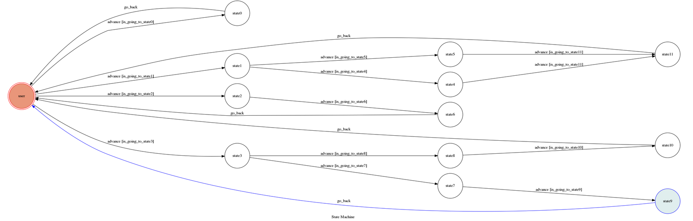

# TOC Project 2019

Template Code for TOC Project 2019

A Facebook messenger bot based on a finite state machine

More details in the [Slides](https://hackmd.io/p/SkpBR-Yam#/) and [FAQ](https://hackmd.io/s/B1Xw7E8kN)

## Setup

### Prerequisite
* Python 3
* Facebook Page and App
* HTTPS Server

#### Install Dependency
```sh
pip3 install -r requirements.txt
```

* pygraphviz (For visualizing Finite State Machine)
    * [Setup pygraphviz on Ubuntu](http://www.jianshu.com/p/a3da7ecc5303)

#### Secret Data

`VERIFY_TOKEN` and `ACCESS_TOKEN` **MUST** be set to proper values.
Otherwise, you might not be able to run your code.

#### Run Locally
You can either setup https server or using `ngrok` as a proxy.

**`ngrok` would be used in the following instruction**

```sh
./ngrok http 5000
```

After that, `ngrok` would generate a https URL.

#### Run the sever

```sh
python3 app.py
```

## Finite State Machine


## Usage
The initial state is set to `user`.

Every time `user` state is triggered to `advance` to another state, it will `go_back` to `user` state after the bot replies corresponding message.

* user
	* Input: "hi cucumber"
		* Reply: "今天想做什麼?\n要來點~button~嗎?\n還是想要~抽妹子~?\n還是~來首音樂吧~"
	* Input: "button"
		* Reply: "你想看~影片~還是要~社群網站~?"
		* Input: "影片"
			* Reply: two button of youtube and voicetube
		* Input: "社群網站"
			* Reply: three button of ig and dcard and ptt
				* Input: "好阿"
					* Reply: 0~5 ptt articles and go_back to user
	* Input: "抽妹子"
		* Reply: a photo of beauty and "才一張你一定覺得不夠!"
		* Input: "對阿"
			* Reply: three photos of beauty and go_back to user
	* Input: "來首音樂吧"
		* Reply: a music and "你覺得~好聽~嗎\n還是你想看youtube~影片~?"
		* Input: "好聽"
			* Reply: a music and "很好聽齁我也這麼覺得!要不要再一首?"
			* Input: "好阿"
				* Reply: a music and "聽了這麼多音樂，該換其他事情做了吧!" and go_back to user 
		* Input: "影片"
			* Reply: a youtube video and "想看其他youtube影片嗎?"
			* Input: "好阿"
					* Reply: a youtube video and go_back to user
	* Input: "抽妹子"
		* Reply: "I'm entering state2"


## Reference
[TOC-Project-2017](https://github.com/Lee-W/TOC-Project-2017) ❤️ [@Lee-W](https://github.com/Lee-W)
# Theory-of-Computation
